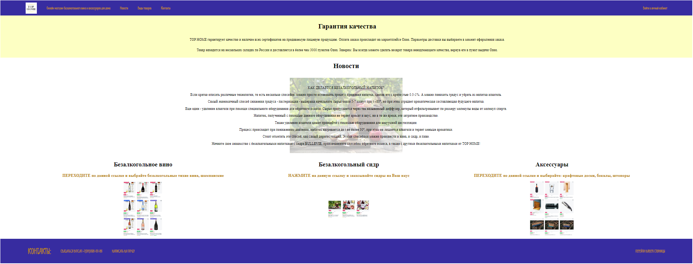

[**Данный файл содержит описание к созданному мини-сайту визитке онлайн магазина TOP HOME на маркетплейсе OZON**](
http://127.0.0.1:5500/index.html "Перейти на сайт")

Сайт создан во время прохождения курса по веб разработке

***
**Файл для запуска index.html**

В проекте есть:
- использование flex, верстка колонок;
- вставка прозрачных изображений на 2 план, фавикон, ховер выделение кнопок;
- кросс-ссылки "Новости","Виды товаров", "Контакты", ссылка "НАВЕРХ";
- внешние ссылки на сайт Озон в блоке "Виды товаров" и в хедере: "Онлайн магазин безалкогольного вина и аксессуаров для дома";
- кнопки с автоссылками на Вотсап "СВЯЗАТЬСЯ ВОТСАП" и отправку письма "НАПИСАТЬ НА ПОЧТУ".

***
Пройдены на семинарах:

1 Урок HTML

2 Урок добавление CSS + личное изучение модуля Flex

можно увидеть эволюцию: первая сборка test-index.html и test-style.css
